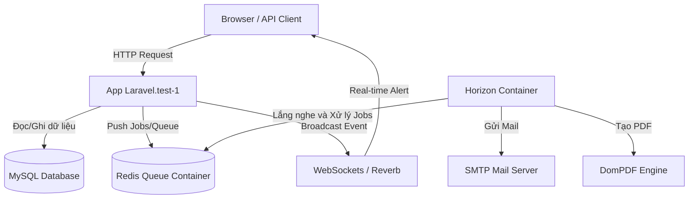
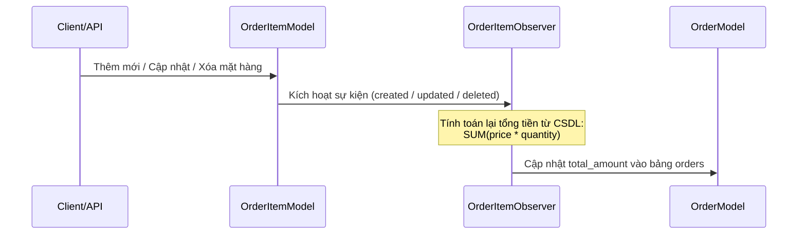
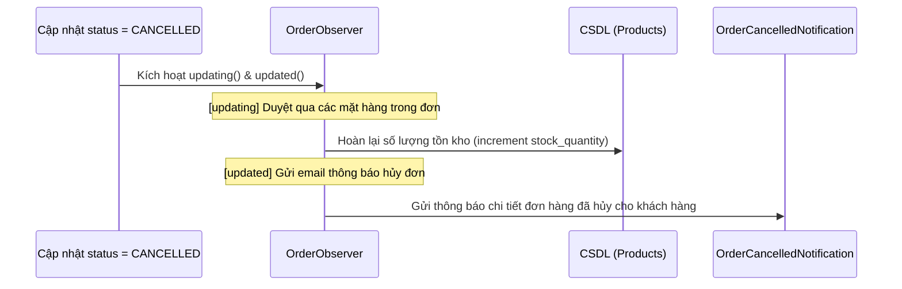

# KIẾN TRÚC HỆ THỐNG & LUỒNG XỬ LÝ NGHIỆP VỤ

Tài liệu này chi tiết hóa cách thức hoạt động của các luồng nghiệp vụ, sự phối hợp giữa các thành phần Laravel (Events, Listeners, Observers, Jobs, Notifications) và hạ tầng công nghệ (Docker, Redis, Horizon, WebSockets) để xây dựng hệ thống xử lý đơn hàng mạnh mẽ, tự động và dễ bảo trì.

---

## 1. Sơ Đồ Tổng Quan Hạ Tầng & Công Nghệ

Hệ thống được thiết kế theo mô hình **Event-Driven Architecture** (Kiến trúc hướng sự kiện) và chạy trên nền tảng container Docker:



### Các công nghệ cốt lõi:
1. **Laravel 11**: Khung ứng dụng chính, tận dụng tính năng tự động khám phá sự kiện (**Event Auto-Discovery**).
2. **Docker Container**: Chia các thành phần hệ thống thành các dịch vụ độc lập:
   - `app_test-laravel.test-1`: Xử lý HTTP Request từ người dùng.
   - `app_test-redis-1`: Lưu trữ hàng đợi (Queue) và cache.
   - `app_test-horizon-1`: Quản lý các tiến trình chạy ngầm xử lý queue.
3. **Laravel Horizon**: Bảng điều khiển giám sát và cấu hình các queue worker tối ưu cho Redis.
4. **Barryvdh DomPDF**: Thư viện sinh file PDF từ giao diện HTML/Blade, sử dụng font **DejaVu Sans** để tương thích hoàn toàn với tiếng Việt Unicode.
5. **Real-time WebSockets**: Sử dụng để phát thông báo tức thời đến quản trị viên khi có các sự kiện đặc biệt (ví dụ: đơn hàng lớn).

---

## 2. Chi Tiết Các Luồng Nghiệp Vụ Cốt Lõi

### Luồng 1: Tính toán tự động tổng tiền đơn hàng (`total_amount`)

Để đảm bảo trường `total_amount` trong bảng `orders` luôn khớp với tổng số tiền của các mặt hàng trong bảng `order_items`, hệ thống sử dụng **Eloquent Observers**.



*   **Tại sao không dùng `OrderObserver` để tính tổng tiền?**
    *   Khi bạn thay đổi thông tin chi tiết một mặt hàng (thay đổi số lượng, xóa bớt sản phẩm), Eloquent chỉ lưu thay đổi trên bảng `order_items` chứ không lưu trên bảng `orders`.
    *   Do đó, các sự kiện cập nhật của `OrderModel` sẽ **không được kích hoạt**.
    *   Vì vậy, ta phải dùng **`OrderItemObserver`** để bắt các thay đổi của từng dòng sản phẩm rồi cập nhật ngược lại cho đơn hàng cha.

---

### Luồng 2: Quy trình khi Đơn Hàng chuyển sang Đã Thanh Toán (`COMPLETED`)

Khi trạng thái đơn hàng cập nhật thành `COMPLETED`, hệ thống thực hiện đồng thời nhiều nhiệm vụ ngầm để tăng tốc độ phản hồi API cho người dùng.

```mermaid
graph TD
    OrderUpdate[Cập nhật status = COMPLETED] -->|Kích hoạt| OrderObserver[OrderObserver@updated]
    OrderObserver -->|Kích hoạt Event| OrderPaidEvent[Event: OrderPaid]
    
    %% Listeners
    OrderPaidEvent -->|Listener 1| SendMailListener[SendOrderConfirmationEmail]
    OrderPaidEvent -->|Listener 2| UpdateLoyaltyListener[UpdateCustomerLoyaltyPoints]
    
    %% Async Actions in Queue
    subgraph Queue_Notifications [Hàng đợi: notifications]
        SendMailListener -->|1. Gửi Notification| OrderConfirmMail[OrderConfirmationNotification]
        SendMailListener -->|2. Dispatch Job| ProcessPDF[ProcessOrderInvoicePDF]
        ProcessPDF -->|3. Tạo & Lưu PDF| StorageFolder[Lưu file vào storage/app/public/invoices/]
    end
    
    subgraph Queue_Default [Hàng đợi: default]
        UpdateLoyaltyListener -->|Tăng điểm tích lũy| LoyaltyPoint[Cộng điểm cho Khách hàng]
    end
```

1.  **Cập nhật trạng thái**: Khi đơn hàng được đổi sang trạng thái `COMPLETED` (Đã thanh toán), `OrderObserver@updated` sẽ kiểm tra sự thay đổi này.
2.  **Phát Event `OrderPaid`**: Sự kiện `OrderPaid` được kích hoạt và mang theo thông tin đơn hàng.
3.  **Xử lý bất đồng bộ (Asynchronous Queue)**:
    *   **`SendOrderConfirmationEmail` (Queue: `notifications`)**:
        *   Gửi email xác nhận đơn hàng chứa thông tin chi tiết hóa đơn tới Email của khách hàng.
        *   Đẩy Job `ProcessOrderInvoicePDF` vào queue để tiến hành biên dịch HTML từ file Blade [order_pdf.blade.php](file:///d:/xampp/htdocs/new/project/app_test/resources/views/pdfs/order_pdf.blade.php) thành file PDF hóa đơn chuyên nghiệp. File PDF này sau khi tạo xong sẽ tự động lưu trữ tại thư mục `storage/app/public/invoices/`.
    *   **`UpdateCustomerLoyaltyPoints` (Queue: `default`)**:
        *   Tự động tính toán điểm tích lũy của khách hàng dựa trên tổng tiền hóa đơn vừa thanh toán và cập nhật vào bảng khách hàng.

---

### Luồng 3: Quy trình khi Đơn Hàng bị Hủy (`CANCELLED`)



1.  **Hoàn trả kho (`updating`)**: 
    *   Trước khi trạng thái đơn hàng bị thay đổi trên database, `OrderObserver@updating` sẽ duyệt qua toàn bộ các mặt hàng trong đơn hàng và cộng trả lại số lượng tồn kho (`stock_quantity`) của từng sản phẩm tương ứng trong bảng `products`.
2.  **Thông báo hủy đơn (`updated`)**:
    *   Sau khi lưu thành công trạng thái `CANCELLED`, hệ thống gọi `OrderCancelledNotification` gửi mail thông báo hủy kèm danh sách chi tiết đơn hàng đã hủy cho khách hàng. Tác vụ này cũng được chạy ngầm trên hàng đợi `notifications`.

---

### Luồng 4: Phát hiện và xử lý Đơn hàng lớn (Hóa đơn trên 10,000,000 VNĐ)

```mermaid
graph LR
    Create[Tạo đơn hàng thành công] -->|Kích hoạt| OrderObserver[OrderObserver@created]
    OrderObserver -->|Kiểm tra| Condition{total_amount > 10.000.000 VNĐ?}
    Condition -->|Đúng| BroadcastEvent[Broadcast: BigOrderPlaced]
    BroadcastEvent -->|Đẩy qua WebSockets| RealtimeAlert[Thông báo Real-time cho Admin]
```

*   Khi một đơn hàng có giá trị cao được tạo, `OrderObserver@created` phát hiện tổng tiền lớn hơn 10 triệu đồng.
*   Hệ thống kích hoạt phát quảng bá (Broadcast) Event `BigOrderPlaced` qua giao thức WebSockets.
*   Ứng dụng Admin/Dashboard của doanh nghiệp sẽ ngay lập tức hiển thị cảnh báo đẩy (Real-time Push Notification) mà không cần phải tải lại trang.

---

## 3. Kiến Thức Cần Lưu Ý Khi Vận Hành & Bảo Trì

> [!IMPORTANT]
> **1. Horizon là một tiến trình Daemon (Chạy ngầm liên tục)**
> Vì Horizon load toàn bộ mã nguồn PHP vào bộ nhớ RAM của container để xử lý hàng đợi nhanh hơn, nên **mọi thay đổi** về code xử lý Job, Listener, Notification hay Config sẽ **không có tác dụng** cho đến khi Horizon được restart lại.
> *   Lệnh restart: `docker compose restart horizon`

> [!TIP]
> **2. Xuất hóa đơn PDF tiếng Việt với DomPDF**
> *   Để hiển thị chính xác các ký tự tiếng Việt (như `đ, á, ớ, ỹ, ...`), bắt buộc file CSS trong template Blade PDF phải đặt thuộc tính:
>     ```css
>     body { font-family: "DejaVu Sans", sans-serif; }
>     ```
> *   Không sử dụng các font mặc định của trình duyệt hoặc font Google tải trực tiếp qua CDN (vì DomPDF chạy offline trong PHP không thể tải font động từ bên ngoài dễ dàng và chính xác).

> [!WARNING]
> **3. Tránh kích hoạt đè sự kiện (Event Loop)**
> *   Khi cập nhật dữ liệu của chính Model đó bên trong các hàm xử lý Event hoặc Observer, phải sử dụng phương thức `withoutEvents` hoặc trực tiếp cập nhật thông qua câu lệnh SQL thuần / Query Builder để tránh tạo ra vòng lặp vô hạn (ví dụ: `Save` kích hoạt `updated`, `updated` lại gọi `Save` tiếp).
